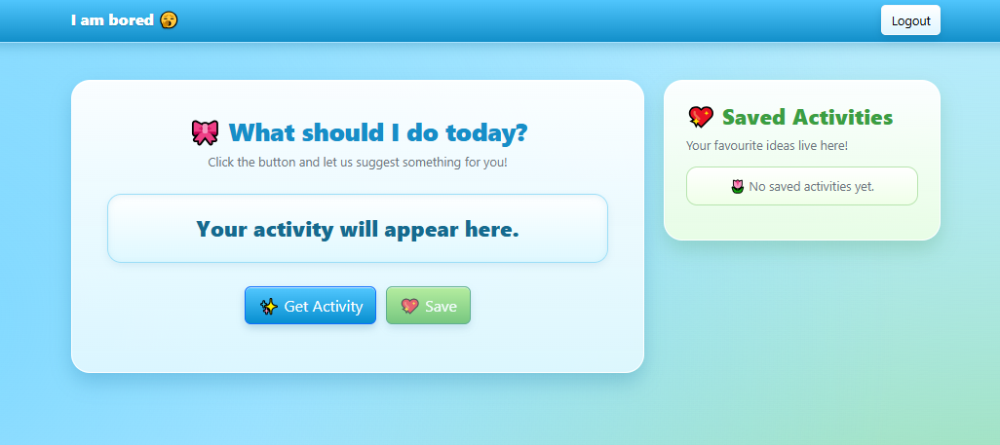

# 🥱 I am Bored

### Because staring at the ceiling for 6 hours is not a hobby.

**I am Bored** is an activity discovery dashboard for those moments when your brain says:

> "I want to do something... but I have absolutely no idea what."

Click a button, get a random activity, and maybe discover something more productive than refreshing social media for the 47th time.

## Take a Glimpse

Behold, the boredom-destroying machine:

## Features

- **Login** — because apparently even boredom needs security
- **Random Activities** — let the internet decide what you should do
- **API Powered** — activities are fetched from a public API
- **Save Activities** — found something that doesn't sound terrible? Save it!
- **Duplicate Protection** — no, you don't need to save the same activity 12 times
- **Delete Activities** — changed your mind? Make it disappear
- **Responsive Design** — works on different screen sizes
- **Bootstrap + CSS** — because raw HTML deserves nice clothes

## Built With

- HTML
- CSS
- JavaScript
- Bootstrap
- Fetch API
- A severe case of boredom

## How to Use

1. Log in.
**username: admin**
**password:123** .
2. Click **Get Activity**.
3. Question the activity the API has chosen for you.
4. Click **Save Activity** if you actually like it.
5. Click **Delete** if you immediately regret your decision.
6. Repeat until boredom has been defeated.

## Mission

Turning:

**"I'm bored."**

into:

**"Fine, I guess I'll do something."**

